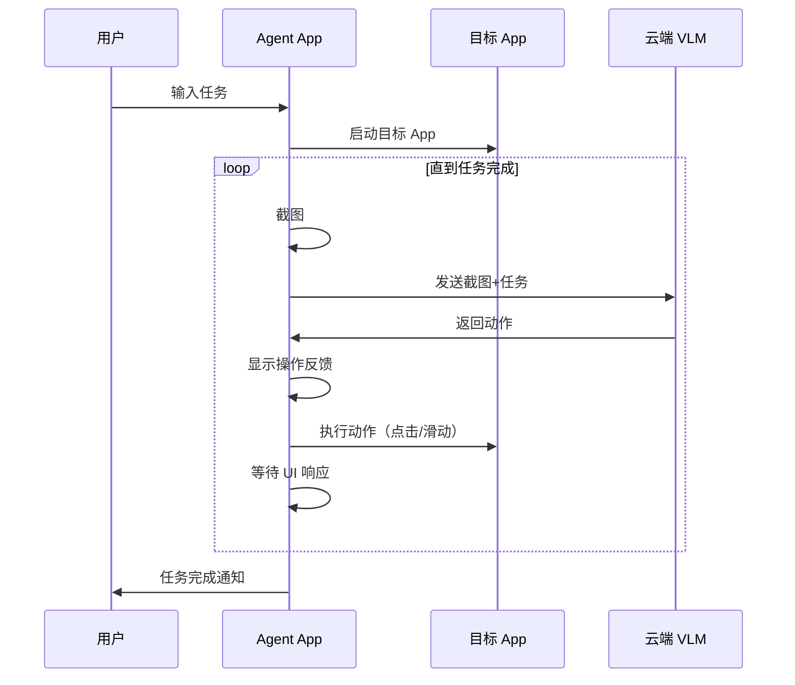

# Phone Agent Android App 设计文档

## 1. 概述

将现有的 PC 端 Phone Agent 移植为 Android App，实现设备本地自动化。Agent 全屏接管目标 App，用户可以实时观看自动化操作过程。

## 2. 核心功能

| 功能 | 描述 |
|------|------|
| 任务输入 | 自然语言描述任务，如"打开京东搜索蓝牙耳机" |
| 全屏接管 | Agent 控制目标 App，用户可观看操作过程 |
| VLM 决策 | 调用云端 VLM 分析屏幕并决策 |
| 自动操作 | 模拟点击、滑动、输入等 |
| 操作可视化 | 显示点击位置、滑动轨迹等视觉反馈 |
| 用户接管 | 用户可随时中断并手动操作 |

## 3. 技术架构

```
┌─────────────────────────────────────────────────────────┐
│                     Phone Agent App                      │
├─────────────────────────────────────────────────────────┤
│  ┌─────────────┐  ┌─────────────┐  ┌─────────────────┐  │
│  │    UI 层    │  │  任务调度器  │  │   VLM 客户端    │  │
│  │ (Compose)  │  │             │  │ (OkHttp/Retrofit)│  │
│  └─────────────┘  └─────────────┘  └─────────────────┘  │
├─────────────────────────────────────────────────────────┤
│                      核心引擎层                          │
│  ┌─────────────┐  ┌─────────────┐  ┌─────────────────┐  │
│  │  截图模块   │  │  输入注入   │  │   可视化反馈    │  │
│  └─────────────┘  └─────────────┘  └─────────────────┘  │
├─────────────────────────────────────────────────────────┤
│                      系统交互层                          │
│  ┌─────────────────────────────────────────────────────┐│
│  │              Root Shell (libsu)                     ││
│  └─────────────────────────────────────────────────────┘│
└─────────────────────────────────────────────────────────┘
```

## 4. 实现方案

### 4.1 截图模块

```kotlin
suspend fun captureScreen(): Bitmap {
    val process = Runtime.getRuntime().exec("su -c screencap -p /sdcard/agent_screenshot.png")
    process.waitFor()
    return BitmapFactory.decodeFile("/sdcard/agent_screenshot.png")
}
```

### 4.2 活动界面检测（优化）

在截图前检测界面是否变化，避免不必要的 VLM 调用：

```kotlin
class ActivityMonitor {
    private var lastActivityHash: String? = null
    private var lastScreenshotHash: String? = null
    
    // 获取当前活动 Activity
    fun getCurrentActivity(): String {
        val output = executeRoot("dumpsys activity activities | grep mResumedActivity")
        return parseActivityName(output)
    }
    
    // 检测 Activity 是否变化
    fun hasActivityChanged(): Boolean {
        val current = getCurrentActivity()
        val changed = current != lastActivityHash
        lastActivityHash = current
        return changed
    }
    
    // 快速比较截图哈希（检测页面内容变化）
    fun hasScreenChanged(screenshot: Bitmap): Boolean {
        val hash = calculatePerceptualHash(screenshot)
        val changed = hash != lastScreenshotHash
        lastScreenshotHash = hash
        return changed
    }
}

// 优化后的执行流程
fun executeStep() {
    // 1. 快速检查 Activity 是否变化
    if (!activityMonitor.hasActivityChanged()) {
        delay(500)  // Activity 未变化，等待
        return
    }
    
    // 2. 截图并检查内容变化
    val screenshot = captureScreen()
    if (!activityMonitor.hasScreenChanged(screenshot)) {
        delay(500)  // 页面内容未变化，可能在加载中
        return
    }
    
    // 3. 仅在真正需要时调用 VLM
    val action = vlmClient.analyze(screenshot, task)
    executeAction(action)
}
```

### 4.3 输入注入模块

```kotlin
object InputInjector {
    fun tap(x: Int, y: Int) {
        executeRoot("input tap $x $y")
    }
    
    fun swipe(x1: Int, y1: Int, x2: Int, y2: Int, duration: Int = 300) {
        executeRoot("input swipe $x1 $y1 $x2 $y2 $duration")
    }
    
    fun inputText(text: String) {
        executeRoot("input text '${text.replace(" ", "%s")}'")
    }
    
    fun pressKey(keycode: Int) {
        executeRoot("input keyevent $keycode")
    }
    
    private fun executeRoot(cmd: String) {
        Runtime.getRuntime().exec("su -c $cmd").waitFor()
    }
}
```

### 4.4 App 启动模块

```kotlin
object AppLauncher {
    fun launchApp(packageName: String) {
        val cmd = "monkey -p $packageName -c android.intent.category.LAUNCHER 1"
        executeRoot(cmd)
    }
    
    fun getCurrentApp(): String {
        val output = executeRootWithOutput("dumpsys activity activities | grep mResumedActivity")
        // 解析当前前台 App
        return parsePackageName(output)
    }
}
```

### 4.5 VLM 客户端

```kotlin
interface VLMService {
    @POST("v1/chat/completions")
    suspend fun chat(@Body request: ChatRequest): ChatResponse
}

data class ChatRequest(
    val model: String,
    val messages: List<Message>,
    val max_tokens: Int = 4096
)
```

## 5. 用户界面设计

### 5.1 主界面

```
┌─────────────────────────────────────┐
│  📱 Phone Agent                     │
├─────────────────────────────────────┤
│  ┌───────────────────────────────┐  │
│  │ 输入任务描述...               │  │
│  └───────────────────────────────┘  │
│                                     │
│  [🚀 开始执行]                       │
│                                     │
│  ───────── 最近任务 ─────────        │
│  • 京东搜索蓝牙耳机 ✅               │
│  • 打开微信发消息 ✅                 │
└─────────────────────────────────────┘
```

### 5.2 执行界面（全屏接管）

```
┌─────────────────────────────────────────────────────────┐
│  🤖 Phone Agent 正在帮你操作                             │
├─────────────────────────────────────────────────────────┤
│                                                         │
│                    目标 App 界面                         │
│                  (京东/淘宝/微信等)                       │
│                                                         │
│                       👆                                │
│                   (点击动画效果)                         │
│                                                         │
├─────────────────────────────────────────────────────────┤
│  💭 "正在搜索蓝牙耳机..."                                │
│  进度: ████████░░ 4/5                                   │
│  [⏸️ 暂停]    [⏹️ 取消]    [✋ 我来操作]                  │
└─────────────────────────────────────────────────────────┘
```

## 6. 操作可视化

### 6.1 视觉反馈

```kotlin
object VisualFeedback {
    // 点击涟漪动画
    fun showTapRipple(x: Int, y: Int) {
        val overlay = FloatingOverlay.getInstance()
        overlay.showRippleAnimation(x, y, duration = 300)
    }
    
    // 滑动轨迹
    fun showSwipePath(x1: Int, y1: Int, x2: Int, y2: Int) {
        val overlay = FloatingOverlay.getInstance()
        overlay.showSwipeLine(x1, y1, x2, y2, duration = 500)
    }
}
```

### 6.2 状态反馈

| 状态 | 显示内容 |
|------|---------|
| 思考中 | 💭 "分析当前页面..." + 加载动画 |
| 执行中 | 🎬 "正在点击搜索按钮" |
| 等待中 | ⏳ "等待页面加载..." |
| 完成 | ✅ "任务完成！" |
| 错误 | ❌ "操作失败，是否重试？" |

## 7. 用户接管机制

```kotlin
class TakeoverDetector {
    fun onUserTakeover() {
        // 1. 暂停 Agent
        AgentEngine.pause()
        
        // 2. 显示提示
        showToast("已暂停自动操作，您可以手动操作")
        
        // 3. 显示恢复按钮
        FloatingButton.show {
            Text("🤖 继续自动执行")
            onClick { AgentEngine.resume() }
        }
    }
}
```

## 8. 权限需求

| 权限 | 用途 | 必须 |
|------|------|------|
| Root | 截图、输入注入、启动 App | ✅ |
| `SYSTEM_ALERT_WINDOW` | 悬浮层（操作可视化） | ✅ |
| `FOREGROUND_SERVICE` | 后台运行 | ✅ |
| `INTERNET` | VLM API 调用 | ✅ |
| `WAKE_LOCK` | 防止屏幕休眠 | ✅ |

## 9. 屏幕唤醒机制

在 Agent 执行期间保持屏幕常亮，防止因休眠导致操作失败：

```kotlin
class ScreenWakeLock(private val context: Context) {
    private var wakeLock: PowerManager.WakeLock? = null
    
    fun acquire() {
        val pm = context.getSystemService(Context.POWER_SERVICE) as PowerManager
        wakeLock = pm.newWakeLock(
            PowerManager.SCREEN_BRIGHT_WAKE_LOCK or PowerManager.ACQUIRE_CAUSES_WAKEUP,
            "PhoneAgent::ExecutionLock"
        )
        wakeLock?.acquire(30 * 60 * 1000L)  // 最长 30 分钟
    }
    
    fun release() {
        wakeLock?.release()
        wakeLock = null
    }
}

// 使用方式
class AgentEngine {
    private val wakeLock = ScreenWakeLock(context)
    
    fun startTask(task: String) {
        wakeLock.acquire()  // 开始时获取锁
        // ... 执行任务 ...
    }
    
    fun stopTask() {
        wakeLock.release()  // 结束时释放锁
    }
}
```

## 10. 执行流程



## 11. 技术栈

| 层级 | 技术 |
|------|------|
| UI | Kotlin + Jetpack Compose |
| 网络 | OkHttp + Retrofit |
| 异步 | Kotlin Coroutines + Flow |
| DI | Hilt |
| Root | libsu |
| 本地存储 | DataStore |

## 12. 可行性评估

### ✅ 可行

| 功能 | 可行性 | 说明 |
|------|--------|------|
| Root 截图 | ✅ | `screencap` 命令成熟稳定 |
| Root 输入注入 | ✅ | `input` 命令成熟稳定 |
| 启动 App | ✅ | `monkey` 或 `am start` |
| VLM 调用 | ✅ | 标准 HTTP 请求 |
| 悬浮层 | ✅ | 标准 Android API |

### ⚠️ 潜在挑战

| 挑战 | 解决方案 |
|------|---------|
| Root 权限管理 | 使用 libsu 库处理 |
| 省电模式杀后台 | 前台服务 + 电池优化白名单 |
| 截图性能 | 限制截图频率，使用内存缓存 |

## 13. 开发计划

| 阶段 | 内容 | 工时 |
|------|------|------|
| Phase 1 | 基础框架 + Root 工具类 | 2-3 天 |
| Phase 2 | 截图 + 输入注入 | 2 天 |
| Phase 3 | VLM 集成 + 决策引擎 | 3 天 |
| Phase 4 | UI + 操作可视化 | 2 天 |
| Phase 5 | 测试 + 优化 | 3 天 |
| **总计** | | **12-13 天** |

## 14. 总结

**结论：技术上完全可行**

核心依赖：
1. Root 权限（Magisk）
2. 云端 VLM API（OpenAI 兼容）

设计原则：
- ✅ 不注入任何 App
- ✅ 不修改任何 App
- ✅ 只模拟用户操作
- ✅ 目标 App 完全无感知

豆包风格体验：
- ✅ 全屏接管模式
- ✅ 操作可视化（点击涟漪/滑动轨迹）
- ✅ 实时状态反馈
- ✅ 用户随时接管

## 15. 后续扩展（可选）

以下功能可在核心功能稳定后添加：

| 功能 | 描述 |
|------|------|
| 小窗模式 | 目标 App 在小窗运行，用户可继续做其他事 |
| 语音交互 | 语音输入任务、语音播报状态 |
| 多轮对话 | 复杂任务的追问和确认 |
| 任务模板 | 保存常用任务，一键执行 |
