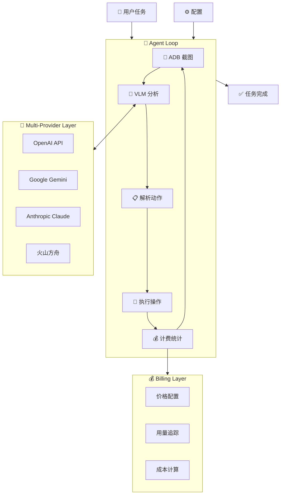
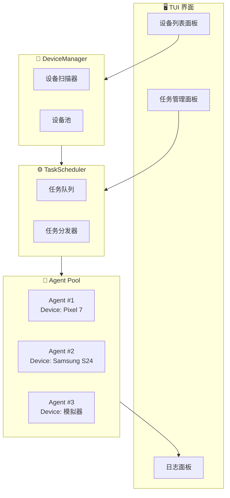

# Android Phone Agent 设计文档

> 一个支持多 VLM 提供商、多 App 专属 Prompt 和模型计费的手机自动化智能体框架。灵感来自：[Open-AutoGLM](https://github.com/zai-org/Open-AutoGLM)

---

## 📋 目录

1. [系统概览](#系统概览)
2. [核心架构](#核心架构)
3. [模块详细设计](#模块详细设计)
4. [多模型适配层](#多模型适配层)
5. [模型计费系统](#模型计费系统)
6. [多设备管理](#多设备管理) ⭐ 新增
7. [App 专属 Prompt 系统](#app-专属-prompt-系统)
8. [项目结构](#项目结构)
9. [配置系统](#配置系统)
10. [扩展指南](#扩展指南)

---

## 系统概览

### 核心工作流程



### 设计原则

| 原则 | 说明 |
|------|------|
| **提供商无关** | 统一抽象层，轻松切换 VLM 提供商 |
| **插件化 Prompt** | App 专属 Prompt 可热插拔，支持 YAML/Python 配置 |
| **类型安全** | 使用 Pydantic 模型进行请求/响应验证 |
| **成本透明** | 实时计费统计，支持多种计费模式 |
| **异步优先** | 支持异步 API 调用，提高并发性能 |

---

## 核心架构

### 分层架构图

```
┌─────────────────────────────────────────────────────────────┐
│                      🎯 Application Layer                    │
│  ┌─────────────┐  ┌─────────────┐  ┌─────────────────────┐  │
│  │   CLI App   │  │   Web API   │  │   Python SDK        │  │
│  └─────────────┘  └─────────────┘  └─────────────────────┘  │
├─────────────────────────────────────────────────────────────┤
│                      🤖 Agent Core Layer                     │
│  ┌─────────────────────────────────────────────────────────┐│
│  │  PhoneAgent: 任务调度 / 状态管理 / 步骤执行              ││
│  └─────────────────────────────────────────────────────────┘│
├─────────────────────────────────────────────────────────────┤
│                   🧠 Model Abstraction Layer                 │
│  ┌──────────────────────────────────────────────────────────┐│
│  │                    VLMClient (Abstract)                  ││
│  │  ┌──────────┐ ┌──────────┐ ┌──────────┐ ┌──────────────┐││
│  │  │ OpenAI   │ │ Gemini   │ │Claude    │ │ 火山方舟     │││
│  │  │ Client   │ │ Client   │ │Client    │ │ Client       │││
│  │  └──────────┘ └──────────┘ └──────────┘ └──────────────┘││
│  └──────────────────────────────────────────────────────────┘│
├─────────────────────────────────────────────────────────────┤
│                    💰 Billing Layer (NEW)                    │
│  ┌──────────────────────────────────────────────────────────┐│
│  │  BillingManager: 价格配置 / 用量追踪 / 成本报告          ││
│  └──────────────────────────────────────────────────────────┘│
├─────────────────────────────────────────────────────────────┤
│                    📝 Prompt Management Layer                │
│  ┌──────────────────────────────────────────────────────────┐│
│  │  PromptManager: 系统 Prompt / App 专属 Prompt / 动态注入 ││
│  └──────────────────────────────────────────────────────────┘│
├─────────────────────────────────────────────────────────────┤
│                    📱 Device Control Layer                   │
│  ┌──────────────────────────────────────────────────────────┐│
│  │  ADBController: 截图 / 点击 / 滑动 / 输入 / 应用管理     ││
│  └──────────────────────────────────────────────────────────┘│
└─────────────────────────────────────────────────────────────┘
```

---

## 模块详细设计

### 1. Agent Core (`agent/`)

```python
# agent/core.py
from pydantic import BaseModel
from typing import Any

class AgentConfig(BaseModel):
    """Agent 配置"""
    max_steps: int = 100
    device_id: str | None = None
    language: str = "zh"
    verbose: bool = True
    # 模型提供商配置
    provider: str = "openai"  # openai | gemini | anthropic | volcano
    model_config: dict[str, Any] = {}
    # 计费配置
    enable_billing: bool = True  # 是否启用计费

class StepResult(BaseModel):
    """单步执行结果"""
    success: bool
    finished: bool
    action: dict[str, Any] | None
    thinking: str
    message: str | None = None
    # 计费信息
    step_cost: float = 0.0
    prompt_tokens: int = 0
    completion_tokens: int = 0

class PhoneAgent:
    """手机自动化智能体核心"""
    
    def __init__(
        self,
        config: AgentConfig,
        vlm_client: "BaseVLMClient",
        prompt_manager: "PromptManager",
        action_handler: "ActionHandler",
        billing_manager: "BillingManager | None" = None,
    ):
        self.config = config
        self.vlm_client = vlm_client
        self.prompt_manager = prompt_manager
        self.action_handler = action_handler
        self.billing_manager = billing_manager
        self._context: list[dict] = []
        self._step_count = 0
        self._total_cost = 0.0
    
    def run(self, task: str) -> str:
        """执行任务"""
        self.reset()
        
        system_prompt = self.prompt_manager.get_system_prompt(self.config.language)
        self._context.append({"role": "system", "content": system_prompt})
        
        while self._step_count < self.config.max_steps:
            result = self._execute_step(task if self._step_count == 0 else None)
            
            # 累计成本
            self._total_cost += result.step_cost
            
            if result.finished:
                self._print_billing_summary()
                return result.message or "任务完成"
        
        self._print_billing_summary()
        return "达到最大步数限制"
    
    def _print_billing_summary(self) -> None:
        """打印计费摘要"""
        if self.billing_manager and self.config.enable_billing:
            summary = self.billing_manager.get_task_summary()
            print(f"\n{'='*50}")
            print(f"💰 任务成本统计:")
            print(f"   提供商: {summary.provider}")
            print(f"   模型: {summary.model}")
            print(f"   输入 Tokens: {summary.total_prompt_tokens:,}")
            print(f"   输出 Tokens: {summary.total_completion_tokens:,}")
            print(f"   总成本: ${summary.total_cost:.6f} (≈ ¥{summary.total_cost * 7.2:.4f})")
            print(f"{'='*50}\n")
```

### 2. Action Handler (`agent/actions.py`)

```python
# agent/actions.py
from dataclasses import dataclass
from enum import Enum
from typing import Callable

class ActionType(str, Enum):
    TAP = "Tap"
    SWIPE = "Swipe"
    TYPE = "Type"
    LAUNCH = "Launch"
    BACK = "Back"
    HOME = "Home"
    WAIT = "Wait"
    LONG_PRESS = "Long Press"
    DOUBLE_TAP = "Double Tap"
    FINISH = "finish"
    PAUSE = "pause"

@dataclass
class ActionResult:
    success: bool
    should_finish: bool
    message: str | None = None

class ActionHandler:
    """动作处理器"""
    
    def __init__(self, adb: "ADBController"):
        self.adb = adb
        self._handlers: dict[ActionType, Callable] = {
            ActionType.TAP: self._handle_tap,
            ActionType.SWIPE: self._handle_swipe,
            ActionType.TYPE: self._handle_type,
            ActionType.LAUNCH: self._handle_launch,
            # ... 其他处理器
        }
    
    def execute(self, action: dict, screen_width: int, screen_height: int) -> ActionResult:
        """执行动作"""
        action_type = ActionType(action.get("action", action.get("_metadata")))
        handler = self._handlers.get(action_type)
        if handler:
            return handler(action, screen_width, screen_height)
        return ActionResult(False, False, f"未知动作: {action_type}")
    
    def _convert_coords(self, element: list[int], width: int, height: int) -> tuple[int, int]:
        """相对坐标(0-1000)转绝对像素"""
        return int(element[0] / 1000 * width), int(element[1] / 1000 * height)
```

---

## 多模型适配层

### 抽象基类设计

```python
# providers/base.py
from abc import ABC, abstractmethod
from pydantic import BaseModel
from typing import Any

class VLMResponse(BaseModel):
    """统一响应格式"""
    thinking: str
    action: str
    raw_content: str
    # Token 统计 (用于计费)
    prompt_tokens: int = 0
    completion_tokens: int = 0
    total_tokens: int = 0

class BaseVLMClient(ABC):
    """VLM 客户端抽象基类"""
    
    @abstractmethod
    def request(self, messages: list[dict[str, Any]]) -> VLMResponse:
        """发送请求并获取响应"""
        pass
    
    @abstractmethod
    def parse_response(self, raw_content: str) -> tuple[str, str]:
        """解析响应为 (thinking, action)"""
        pass
    
    @property
    @abstractmethod
    def provider_name(self) -> str:
        """提供商名称"""
        pass
    
    @property
    @abstractmethod
    def model_name(self) -> str:
        """模型名称 (用于计费查找)"""
        pass
```

### Provider 工厂

```python
# providers/__init__.py
from typing import Literal
from .base import BaseVLMClient
from .openai_compatible import OpenAIClient, OpenAIConfig
from .gemini import GeminiClient, GeminiConfig
from .anthropic import AnthropicClient, AnthropicConfig
from .volcano import VolcanoClient, VolcanoConfig

ProviderType = Literal["openai", "gemini", "anthropic", "volcano"]

def create_vlm_client(provider: ProviderType, config: dict) -> BaseVLMClient:
    """工厂方法：创建 VLM 客户端"""
    providers = {
        "openai": (OpenAIClient, OpenAIConfig),
        "gemini": (GeminiClient, GeminiConfig),
        "anthropic": (AnthropicClient, AnthropicConfig),
        "volcano": (VolcanoClient, VolcanoConfig),
    }
    
    client_cls, config_cls = providers[provider]
    return client_cls(config_cls(**config))
```

---

## 模型计费系统

### 设计目标

- ✅ 支持 **固定价格** ($/百万tokens)
- ✅ 支持 **区间计费** (按用量阶梯定价)
- ✅ 支持 **免费额度** 配置
- ✅ **实时成本追踪** 和报告
- ✅ 支持 **YAML 配置** 和 **代码注册**

### 计费模型定义

```python
# billing/models.py
from pydantic import BaseModel, Field
from typing import Literal
from enum import Enum

class PricingType(str, Enum):
    """计费类型"""
    FIXED = "fixed"           # 固定价格
    TIERED = "tiered"         # 阶梯计费
    FREE = "free"             # 完全免费

class PriceTier(BaseModel):
    """价格阶梯（用于区间计费）"""
    min_tokens: int = 0                    # 起始 token 数
    max_tokens: int | None = None          # 结束 token 数 (None = 无上限)
    input_price: float                     # 该区间输入价格 ($/百万tokens)
    output_price: float                    # 该区间输出价格 ($/百万tokens)

class ModelPricing(BaseModel):
    """模型计费配置"""
    provider: str                          # 提供商名称
    model: str                             # 模型名称/ID
    display_name: str | None = None        # 显示名称
    pricing_type: PricingType = PricingType.FIXED
    
    # 固定价格模式
    input_price_per_million: float = 0.0   # 输入价格 ($/百万tokens)
    output_price_per_million: float = 0.0  # 输出价格 ($/百万tokens)
    
    # 阶梯计费模式
    tiers: list[PriceTier] = Field(default_factory=list)
    
    # 免费额度
    free_input_tokens: int = 0             # 每月免费输入 tokens
    free_output_tokens: int = 0            # 每月免费输出 tokens
    
    # 元数据
    currency: str = "USD"                  # 货币单位
    last_updated: str | None = None        # 价格更新日期
    notes: str | None = None               # 备注

class UsageRecord(BaseModel):
    """单次调用记录"""
    timestamp: str
    provider: str
    model: str
    prompt_tokens: int
    completion_tokens: int
    input_cost: float
    output_cost: float
    total_cost: float

class TaskBillingSummary(BaseModel):
    """任务计费摘要"""
    provider: str
    model: str
    total_prompt_tokens: int
    total_completion_tokens: int
    total_input_cost: float
    total_output_cost: float
    total_cost: float
    step_count: int
    records: list[UsageRecord] = Field(default_factory=list)
```

### 计费管理器实现

```python
# billing/manager.py
from datetime import datetime
from typing import Any
from .models import ModelPricing, PricingType, UsageRecord, TaskBillingSummary

class BillingManager:
    """计费管理器"""
    
    def __init__(self):
        self._pricing_registry: dict[str, ModelPricing] = {}
        self._usage_records: list[UsageRecord] = []
        self._total_prompt_tokens = 0
        self._total_completion_tokens = 0
        self._total_cost = 0.0
    
    def register_pricing(self, pricing: ModelPricing) -> None:
        """注册模型价格"""
        key = f"{pricing.provider}:{pricing.model}"
        self._pricing_registry[key] = pricing
    
    def register_pricing_from_dict(self, config: dict) -> None:
        """从字典注册模型价格"""
        pricing = ModelPricing(**config)
        self.register_pricing(pricing)
    
    def get_pricing(self, provider: str, model: str) -> ModelPricing | None:
        """获取模型价格配置"""
        key = f"{provider}:{model}"
        return self._pricing_registry.get(key)
    
    def calculate_cost(
        self, 
        provider: str, 
        model: str, 
        prompt_tokens: int, 
        completion_tokens: int
    ) -> tuple[float, float, float]:
        """
        计算调用成本
        
        Returns:
            (input_cost, output_cost, total_cost)
        """
        pricing = self.get_pricing(provider, model)
        
        if pricing is None:
            # 未注册的模型，返回 0 成本但记录警告
            print(f"⚠️ 未找到模型定价配置: {provider}:{model}")
            return 0.0, 0.0, 0.0
        
        if pricing.pricing_type == PricingType.FREE:
            return 0.0, 0.0, 0.0
        
        if pricing.pricing_type == PricingType.FIXED:
            return self._calculate_fixed_cost(pricing, prompt_tokens, completion_tokens)
        
        if pricing.pricing_type == PricingType.TIERED:
            return self._calculate_tiered_cost(pricing, prompt_tokens, completion_tokens)
        
        return 0.0, 0.0, 0.0
    
    def _calculate_fixed_cost(
        self, 
        pricing: ModelPricing, 
        prompt_tokens: int, 
        completion_tokens: int
    ) -> tuple[float, float, float]:
        """计算固定价格成本"""
        # 扣除免费额度
        billable_prompt = max(0, prompt_tokens - pricing.free_input_tokens)
        billable_completion = max(0, completion_tokens - pricing.free_output_tokens)
        
        input_cost = (billable_prompt / 1_000_000) * pricing.input_price_per_million
        output_cost = (billable_completion / 1_000_000) * pricing.output_price_per_million
        
        return input_cost, output_cost, input_cost + output_cost
    
    def _calculate_tiered_cost(
        self, 
        pricing: ModelPricing, 
        prompt_tokens: int, 
        completion_tokens: int
    ) -> tuple[float, float, float]:
        """计算阶梯价格成本"""
        input_cost = 0.0
        output_cost = 0.0
        
        remaining_prompt = prompt_tokens
        remaining_completion = completion_tokens
        
        for tier in sorted(pricing.tiers, key=lambda t: t.min_tokens):
            if remaining_prompt <= 0 and remaining_completion <= 0:
                break
            
            tier_max = tier.max_tokens if tier.max_tokens else float('inf')
            tier_size = tier_max - tier.min_tokens
            
            # 计算该阶梯的输入 tokens
            prompt_in_tier = min(remaining_prompt, tier_size)
            if prompt_in_tier > 0:
                input_cost += (prompt_in_tier / 1_000_000) * tier.input_price
                remaining_prompt -= prompt_in_tier
            
            # 计算该阶梯的输出 tokens
            completion_in_tier = min(remaining_completion, tier_size)
            if completion_in_tier > 0:
                output_cost += (completion_in_tier / 1_000_000) * tier.output_price
                remaining_completion -= completion_in_tier
        
        return input_cost, output_cost, input_cost + output_cost
    
    def record_usage(
        self, 
        provider: str, 
        model: str, 
        prompt_tokens: int, 
        completion_tokens: int
    ) -> UsageRecord:
        """记录一次调用并计算成本"""
        input_cost, output_cost, total_cost = self.calculate_cost(
            provider, model, prompt_tokens, completion_tokens
        )
        
        record = UsageRecord(
            timestamp=datetime.now().isoformat(),
            provider=provider,
            model=model,
            prompt_tokens=prompt_tokens,
            completion_tokens=completion_tokens,
            input_cost=input_cost,
            output_cost=output_cost,
            total_cost=total_cost,
        )
        
        self._usage_records.append(record)
        self._total_prompt_tokens += prompt_tokens
        self._total_completion_tokens += completion_tokens
        self._total_cost += total_cost
        
        return record
    
    def get_task_summary(self) -> TaskBillingSummary:
        """获取当前任务的计费摘要"""
        if not self._usage_records:
            return TaskBillingSummary(
                provider="N/A",
                model="N/A",
                total_prompt_tokens=0,
                total_completion_tokens=0,
                total_input_cost=0.0,
                total_output_cost=0.0,
                total_cost=0.0,
                step_count=0,
            )
        
        last_record = self._usage_records[-1]
        total_input = sum(r.input_cost for r in self._usage_records)
        total_output = sum(r.output_cost for r in self._usage_records)
        
        return TaskBillingSummary(
            provider=last_record.provider,
            model=last_record.model,
            total_prompt_tokens=self._total_prompt_tokens,
            total_completion_tokens=self._total_completion_tokens,
            total_input_cost=total_input,
            total_output_cost=total_output,
            total_cost=self._total_cost,
            step_count=len(self._usage_records),
            records=self._usage_records,
        )
    
    def reset(self) -> None:
        """重置计费统计（新任务时调用）"""
        self._usage_records.clear()
        self._total_prompt_tokens = 0
        self._total_completion_tokens = 0
        self._total_cost = 0.0
    
    def export_report(self, format: str = "json") -> str:
        """导出计费报告"""
        summary = self.get_task_summary()
        if format == "json":
            return summary.model_dump_json(indent=2)
        # 可扩展其他格式
        return str(summary)
```

### YAML 价格配置格式

```yaml
# config/pricing.yaml
providers:
  # ============================================
  # OpenAI 模型定价
  # ============================================
  - provider: openai
    model: gpt-4o
    display_name: GPT-4o
    pricing_type: fixed
    input_price_per_million: 2.50      # $2.50 / 1M tokens
    output_price_per_million: 10.00    # $10.00 / 1M tokens
    last_updated: "2024-12-01"
  
  - provider: openai
    model: gpt-4o-mini
    display_name: GPT-4o Mini
    pricing_type: fixed
    input_price_per_million: 0.15
    output_price_per_million: 0.60
    last_updated: "2024-12-01"
  
  - provider: openai
    model: gpt-4-turbo
    display_name: GPT-4 Turbo
    pricing_type: fixed
    input_price_per_million: 10.00
    output_price_per_million: 30.00
  
  # ============================================
  # Google Gemini 模型定价
  # ============================================
  - provider: gemini
    model: gemini-2.0-flash
    display_name: Gemini 2.0 Flash
    pricing_type: tiered
    tiers:
      - min_tokens: 0
        max_tokens: 128000
        input_price: 0.075         # $0.075 / 1M (≤128K context)
        output_price: 0.30
      - min_tokens: 128000
        max_tokens: null           # 无上限
        input_price: 0.15          # $0.15 / 1M (>128K context)
        output_price: 0.60
    last_updated: "2024-12-01"
  
  - provider: gemini
    model: gemini-1.5-pro
    display_name: Gemini 1.5 Pro
    pricing_type: tiered
    tiers:
      - min_tokens: 0
        max_tokens: 128000
        input_price: 1.25
        output_price: 5.00
      - min_tokens: 128000
        max_tokens: null
        input_price: 2.50
        output_price: 10.00
    last_updated: "2024-12-01"
  
  - provider: gemini
    model: gemini-2.0-flash-lite
    display_name: Gemini 2.0 Flash Lite
    pricing_type: free
    notes: "完全免费，有速率限制"
  
  # ============================================
  # Anthropic Claude 模型定价
  # ============================================
  - provider: anthropic
    model: claude-sonnet-4-20250514
    display_name: Claude Sonnet 4
    pricing_type: fixed
    input_price_per_million: 3.00
    output_price_per_million: 15.00
    last_updated: "2024-12-01"
  
  - provider: anthropic
    model: claude-3-5-sonnet-20241022
    display_name: Claude 3.5 Sonnet
    pricing_type: fixed
    input_price_per_million: 3.00
    output_price_per_million: 15.00
  
  - provider: anthropic
    model: claude-3-5-haiku-20241022
    display_name: Claude 3.5 Haiku
    pricing_type: fixed
    input_price_per_million: 0.80
    output_price_per_million: 4.00
  
  - provider: anthropic
    model: claude-3-opus-20240229
    display_name: Claude 3 Opus
    pricing_type: fixed
    input_price_per_million: 15.00
    output_price_per_million: 75.00
  
  # ============================================
  # 火山方舟（豆包）模型定价 (人民币)
  # ============================================
  - provider: volcano
    model: doubao-1-5-thinking-pro-250415
    display_name: 豆包 1.5 Thinking Pro
    pricing_type: fixed
    input_price_per_million: 0.56    # ¥4 / 1M tokens ≈ $0.56
    output_price_per_million: 2.22   # ¥16 / 1M tokens ≈ $2.22
    currency: CNY
    notes: "价格已转换为美元，原价: 输入¥4/百万, 输出¥16/百万"
  
  - provider: volcano
    model: doubao-1-5-pro-256k
    display_name: 豆包 1.5 Pro 256K
    pricing_type: fixed
    input_price_per_million: 0.11    # ¥0.8 / 1M ≈ $0.11
    output_price_per_million: 0.28   # ¥2 / 1M ≈ $0.28
    currency: CNY
  
  - provider: volcano
    model: doubao-vision-pro-32k
    display_name: 豆包视觉 Pro 32K
    pricing_type: fixed
    input_price_per_million: 0.42    # ¥3 / 1M ≈ $0.42
    output_price_per_million: 1.25   # ¥9 / 1M ≈ $1.25
    currency: CNY
    notes: "视觉模型，支持图像输入"
  
  # ============================================
  # 自部署/本地模型
  # ============================================
  - provider: local
    model: autoglm-phone-9b
    display_name: AutoGLM Phone 9B (本地)
    pricing_type: free
    notes: "本地部署，无 API 成本"
  
  - provider: vllm
    model: custom-model
    display_name: 自定义 vLLM 模型
    pricing_type: free
    notes: "按 GPU 算力成本另计"
```

### 价格配置加载器

```python
# billing/loader.py
import yaml
from pathlib import Path
from .models import ModelPricing, PriceTier, PricingType
from .manager import BillingManager

def load_pricing_config(config_path: str | Path) -> BillingManager:
    """从 YAML 文件加载价格配置"""
    manager = BillingManager()
    
    config_path = Path(config_path)
    if not config_path.exists():
        print(f"⚠️ 价格配置文件不存在: {config_path}")
        return manager
    
    with open(config_path, 'r', encoding='utf-8') as f:
        config = yaml.safe_load(f)
    
    for provider_config in config.get('providers', []):
        # 处理阶梯定价
        if 'tiers' in provider_config:
            provider_config['tiers'] = [
                PriceTier(**tier) for tier in provider_config['tiers']
            ]
        
        pricing = ModelPricing(**provider_config)
        manager.register_pricing(pricing)
        print(f"✅ 已加载定价: {pricing.provider}:{pricing.model}")
    
    return manager


def create_default_pricing_manager() -> BillingManager:
    """创建默认的计费管理器（使用内置价格）"""
    manager = BillingManager()
    
    # 内置默认价格（可被 YAML 覆盖）
    default_pricing = [
        ModelPricing(
            provider="openai",
            model="gpt-4o",
            pricing_type=PricingType.FIXED,
            input_price_per_million=2.50,
            output_price_per_million=10.00,
        ),
        ModelPricing(
            provider="openai",
            model="gpt-4o-mini",
            pricing_type=PricingType.FIXED,
            input_price_per_million=0.15,
            output_price_per_million=0.60,
        ),
        ModelPricing(
            provider="gemini",
            model="gemini-2.0-flash",
            pricing_type=PricingType.FIXED,
            input_price_per_million=0.075,
            output_price_per_million=0.30,
        ),
        ModelPricing(
            provider="anthropic",
            model="claude-sonnet-4-20250514",
            pricing_type=PricingType.FIXED,
            input_price_per_million=3.00,
            output_price_per_million=15.00,
        ),
    ]
    
    for pricing in default_pricing:
        manager.register_pricing(pricing)
    
    return manager
```

### 计费集成示例

```python
# 使用示例
from phone_agent import PhoneAgent, AgentConfig
from phone_agent.providers import create_vlm_client
from phone_agent.billing import load_pricing_config

# 加载价格配置
billing_manager = load_pricing_config("config/pricing.yaml")

# 创建 Agent
agent = PhoneAgent(
    config=AgentConfig(
        provider="openai",
        enable_billing=True,
    ),
    vlm_client=create_vlm_client("openai", {
        "api_key": "sk-xxx",
        "model": "gpt-4o-mini",
    }),
    billing_manager=billing_manager,
)

# 执行任务
result = agent.run("打开微信发消息给张三说你好")

# 获取详细计费报告
report = billing_manager.export_report()
print(report)
```

**输出示例：**
```
==================================================
💰 任务成本统计:
   提供商: openai
   模型: gpt-4o-mini
   输入 Tokens: 15,234
   输出 Tokens: 1,208
   总成本: $0.003010 (≈ ¥0.0217)
==================================================

{
  "provider": "openai",
  "model": "gpt-4o-mini",
  "total_prompt_tokens": 15234,
  "total_completion_tokens": 1208,
  "total_input_cost": 0.002285,
  "total_output_cost": 0.000725,
  "total_cost": 0.003010,
  "step_count": 5,
  "records": [...]
}
```

---

## 多设备管理

支持同时连接多个 Android 设备，并行执行不同任务（类似 Google Jules 的多任务设计）。

### 架构设计



### 设备管理器

```python
# adb/device_manager.py
from pydantic import BaseModel
from enum import Enum
import asyncio

class DeviceState(str, Enum):
    ONLINE = "online"       # 在线，可用
    OFFLINE = "offline"     # 离线
    BUSY = "busy"           # 正在执行任务
    UNAUTHORIZED = "unauthorized"  # 未授权

class DeviceInfo(BaseModel):
    """设备信息"""
    device_id: str              # 设备序列号 (如 emulator-5554, 192.168.1.100:5555)
    state: DeviceState
    model: str | None = None    # 设备型号 (如 Pixel 7)
    android_version: str | None = None
    screen_resolution: tuple[int, int] | None = None
    current_task_id: str | None = None  # 当前执行的任务 ID

class DeviceManager:
    """多设备管理器"""
    
    def __init__(self, adb_host: str = "127.0.0.1", adb_port: int = 5037):
        self.adb_host = adb_host
        self.adb_port = adb_port
        self._devices: dict[str, DeviceInfo] = {}
        self._lock = asyncio.Lock()
    
    async def scan_devices(self) -> list[DeviceInfo]:
        """扫描所有连接的设备"""
        # 执行 adb devices -l 获取设备列表
        ...
    
    async def get_device(self, device_id: str) -> DeviceInfo | None:
        """获取指定设备"""
        return self._devices.get(device_id)
    
    async def get_available_devices(self) -> list[DeviceInfo]:
        """获取所有可用（在线且空闲）的设备"""
        return [d for d in self._devices.values() if d.state == DeviceState.ONLINE]
    
    async def acquire_device(self, device_id: str, task_id: str) -> bool:
        """获取设备使用权（标记为 BUSY）"""
        async with self._lock:
            device = self._devices.get(device_id)
            if device and device.state == DeviceState.ONLINE:
                device.state = DeviceState.BUSY
                device.current_task_id = task_id
                return True
            return False
    
    async def release_device(self, device_id: str) -> None:
        """释放设备（标记为 ONLINE）"""
        async with self._lock:
            device = self._devices.get(device_id)
            if device:
                device.state = DeviceState.ONLINE
                device.current_task_id = None

class ADBDevice:
    """单个设备控制器"""
    
    def __init__(self, device_id: str, adb_host: str = "127.0.0.1", adb_port: int = 5037):
        self.device_id = device_id
        self.adb_host = adb_host
        self.adb_port = adb_port
    
    async def screenshot(self) -> bytes:
        """截取屏幕"""
        ...
    
    async def tap(self, x: int, y: int) -> bool:
        """点击坐标"""
        ...
    
    async def swipe(self, x1: int, y1: int, x2: int, y2: int, duration: int = 300) -> bool:
        """滑动"""
        ...
    
    async def input_text(self, text: str) -> bool:
        """输入文本"""
        ...
    
    async def launch_app(self, package: str) -> bool:
        """启动应用"""
        ...
    
    async def get_screen_size(self) -> tuple[int, int]:
        """获取屏幕分辨率"""
        ...
```

### 任务调度器

```python
# agent/scheduler.py
from pydantic import BaseModel
from enum import Enum
from datetime import datetime
import asyncio
import uuid

class TaskState(str, Enum):
    PENDING = "pending"     # 等待执行
    RUNNING = "running"     # 正在执行
    COMPLETED = "completed" # 已完成
    FAILED = "failed"       # 执行失败
    CANCELLED = "cancelled" # 已取消

class Task(BaseModel):
    """任务定义"""
    task_id: str
    description: str           # 任务描述（用户输入的自然语言指令）
    profile_name: str          # 使用的模型 Profile
    device_id: str | None = None  # 指定设备（None 表示自动分配）
    state: TaskState = TaskState.PENDING
    created_at: datetime
    started_at: datetime | None = None
    completed_at: datetime | None = None
    result: str | None = None
    error: str | None = None
    step_count: int = 0
    total_cost: float = 0.0

class TaskScheduler:
    """任务调度器"""
    
    def __init__(
        self,
        device_manager: DeviceManager,
        profile_manager: "ProfileManager",
        billing_manager: "BillingManager",
        max_concurrent_tasks: int = 5,
    ):
        self.device_manager = device_manager
        self.profile_manager = profile_manager
        self.billing_manager = billing_manager
        self.max_concurrent_tasks = max_concurrent_tasks
        
        self._pending_queue: asyncio.Queue[Task] = asyncio.Queue()
        self._running_tasks: dict[str, Task] = {}
        self._completed_tasks: list[Task] = []
    
    async def submit_task(
        self,
        description: str,
        profile_name: str | None = None,
        device_id: str | None = None,
    ) -> Task:
        """提交新任务"""
        task = Task(
            task_id=str(uuid.uuid4()),
            description=description,
            profile_name=profile_name or self.profile_manager.default_profile.name,
            device_id=device_id,
            created_at=datetime.now(),
        )
        await self._pending_queue.put(task)
        return task
    
    async def run(self) -> None:
        """启动调度循环"""
        while True:
            # 检查是否有可用设备和待执行任务
            if len(self._running_tasks) < self.max_concurrent_tasks:
                try:
                    task = self._pending_queue.get_nowait()
                    asyncio.create_task(self._execute_task(task))
                except asyncio.QueueEmpty:
                    pass
            await asyncio.sleep(0.1)
    
    async def _execute_task(self, task: Task) -> None:
        """执行单个任务"""
        # 1. 获取可用设备
        device_id = task.device_id
        if not device_id:
            devices = await self.device_manager.get_available_devices()
            if not devices:
                # 没有可用设备，放回队列
                await self._pending_queue.put(task)
                return
            device_id = devices[0].device_id
        
        # 2. 获取设备使用权
        if not await self.device_manager.acquire_device(device_id, task.task_id):
            await self._pending_queue.put(task)
            return
        
        try:
            task.state = TaskState.RUNNING
            task.started_at = datetime.now()
            self._running_tasks[task.task_id] = task
            
            # 3. 创建 Agent 并执行
            profile = self.profile_manager.get_profile(task.profile_name)
            device = ADBDevice(device_id)
            agent = PhoneAgent(...)  # 创建 Agent
            
            result = await agent.run_async(task.description)
            
            task.result = result
            task.state = TaskState.COMPLETED
            
        except Exception as e:
            task.error = str(e)
            task.state = TaskState.FAILED
        
        finally:
            task.completed_at = datetime.now()
            await self.device_manager.release_device(device_id)
            del self._running_tasks[task.task_id]
            self._completed_tasks.append(task)
    
    def get_task(self, task_id: str) -> Task | None:
        """获取任务状态"""
        if task_id in self._running_tasks:
            return self._running_tasks[task_id]
        for task in self._completed_tasks:
            if task.task_id == task_id:
                return task
        return None
```

### TUI 多设备界面示例

```
┌─────────────────────────────────────────────────────────────────────────┐
│  📱 Phone Agent - Multi-Device Dashboard                                │
├─────────────────────────────────────────────────────────────────────────┤
│                                                                         │
│  📱 设备列表                          📋 任务队列                        │
│  ┌─────────────────────────────┐     ┌────────────────────────────────┐│
│  │ ● Pixel 7 Pro (已连接)      │     │ 🔄 打开微信发消息给张三        ││
│  │   状态: 执行中              │     │    设备: Pixel 7 Pro           ││
│  │   任务: 打开微信发消息...    │     │    状态: 执行中 (步骤 3/50)    ││
│  │   Profile: deepseek         │     │    Profile: deepseek           ││
│  ├─────────────────────────────┤     ├────────────────────────────────┤│
│  │ ● Samsung S24 (已连接)      │     │ ⏳ 打开淘宝搜索蓝牙耳机        ││
│  │   状态: 空闲                │     │    设备: 待分配                ││
│  │                             │     │    状态: 等待中                ││
│  ├─────────────────────────────┤     ├────────────────────────────────┤│
│  │ ● emulator-5554 (模拟器)    │     │ ✅ 查看今天的天气              ││
│  │   状态: 空闲                │     │    设备: emulator-5554         ││
│  │                             │     │    状态: 已完成 (5 步)         ││
│  │                             │     │    成本: $0.0023               ││
│  └─────────────────────────────┘     └────────────────────────────────┘│
│                                                                         │
│  ────────────────────────────────────────────────────────────────────── │
│                                                                         │
│  📝 输入新任务: [打开抖音搜索美食视频_______________] [提交] [选择设备▼]│
│                                                                         │
│  📊 统计: 已完成 12 个任务 | 总成本 $0.0847 | 平均耗时 45s              │
│                                                                         │
└─────────────────────────────────────────────────────────────────────────┘
```

---

## App 专属 Prompt 系统

### 目录结构

```
prompts/
├── system/
│   ├── default_zh.md       # 默认中文系统 Prompt
│   └── default_en.md       # 默认英文系统 Prompt
├── apps/
│   ├── wechat.yaml         # 微信专属 Prompt
│   ├── taobao.yaml         # 淘宝专属 Prompt
│   ├── douyin.yaml         # 抖音专属 Prompt
│   └── jx3/                # 复杂 App 使用目录
│       ├── main.yaml
│       └── dungeons.yaml
└── custom/                 # 用户自定义 Prompt
    └── my_app.yaml
```

### YAML Prompt 格式

```yaml
# prompts/apps/wechat.yaml
name: 微信
package: com.tencent.mm
aliases:
  - WeChat
  - 微信

system_prompt: |
  ## 微信操作专属指南
  
  ### 界面结构
  - 底部有4个主Tab：微信、通讯录、发现、我
  - 聊天列表在"微信"Tab下
  - 搜索框在顶部
  
  ### 常用操作
  1. 发送消息：进入聊天 → 输入框输入 → 点击发送
  2. 搜索联系人：点击搜索框 → 输入名称 → 选择结果

scenarios:
  send_message:
    trigger: "发送消息|发消息|说"
    prompt: |
      发送消息操作步骤：
      1. 确保在聊天界面
      2. 点击输入框聚焦
      3. 输入文本
      4. 点击"发送"按钮
```

### Prompt 管理器

```python
# prompts/manager.py
import yaml
from pathlib import Path
import re

class PromptManager:
    """Prompt 管理器"""
    
    def __init__(self, prompts_dir: str = "prompts"):
        self.prompts_dir = Path(prompts_dir)
        self._system_prompts: dict[str, str] = {}
        self._app_prompts: dict[str, dict] = {}
        self._loaded = False
    
    def load(self) -> None:
        """加载所有 Prompt"""
        # 加载系统 Prompt
        for lang_file in (self.prompts_dir / "system").glob("*.md"):
            lang = lang_file.stem.replace("default_", "")
            self._system_prompts[lang] = lang_file.read_text(encoding="utf-8")
        
        # 加载 App 专属 Prompt
        for app_file in (self.prompts_dir / "apps").glob("*.yaml"):
            config = yaml.safe_load(app_file.read_text(encoding="utf-8"))
            app_name = config.get("name", app_file.stem)
            self._app_prompts[app_name] = config
            for alias in config.get("aliases", []):
                self._app_prompts[alias] = config
        
        self._loaded = True
    
    def get_system_prompt(self, lang: str = "zh") -> str:
        if not self._loaded:
            self.load()
        return self._system_prompts.get(lang, self._system_prompts.get("zh", ""))
    
    def get_app_prompt(self, app_name: str | None) -> str:
        if not self._loaded:
            self.load()
        if app_name is None:
            return ""
        config = self._app_prompts.get(app_name)
        return config.get("system_prompt", "") if config else ""
    
    def has_app_prompt(self, app_name: str | None) -> bool:
        if not self._loaded:
            self.load()
        return app_name in self._app_prompts if app_name else False
```

---

## 项目结构

```
phone-agent/
├── README.md
├── pyproject.toml
├── requirements.txt
├── .env.example                 # 环境变量示例 ⭐
│
├── phone_agent/
│   ├── __init__.py
│   ├── agent/
│   │   ├── __init__.py
│   │   ├── core.py              # PhoneAgent 核心
│   │   ├── actions.py           # 动作处理器
│   │   └── scheduler.py         # 任务调度器 ⭐ 新增
│   │
│   ├── providers/
│   │   ├── __init__.py          # Provider 工厂
│   │   ├── base.py              # 抽象基类
│   │   ├── openai_compatible.py # OpenAI/vLLM/DeepSeek/OpenRouter
│   │   ├── gemini.py            # Google Gemini
│   │   └── anthropic.py         # Anthropic Claude
│   │
│   ├── billing/
│   │   ├── __init__.py
│   │   ├── models.py            # 计费数据模型
│   │   ├── manager.py           # 计费管理器
│   │   └── loader.py            # 价格配置加载器
│   │
│   ├── prompts/
│   │   ├── __init__.py
│   │   ├── manager.py           # Prompt 管理器
│   │   └── parser.py            # 响应解析器
│   │
│   ├── adb/
│   │   ├── __init__.py
│   │   ├── device_manager.py    # 多设备管理器 ⭐ 新增
│   │   ├── device.py            # 单设备控制器
│   │   ├── input.py             # 文本输入
│   │   └── screenshot.py        # 屏幕截图
│   │
│   ├── config/
│   │   ├── __init__.py
│   │   ├── settings.py          # 全局配置
│   │   └── profile.py           # Profile 管理器 ⭐ 新增
│   │
│   └── tui/                      # TUI 界面 ⭐ 新增
│       ├── __init__.py
│       ├── app.py               # Textual 应用入口
│       ├── screens/
│       │   ├── main.py          # 主界面
│       │   ├── devices.py       # 设备管理界面
│       │   └── tasks.py         # 任务管理界面
│       └── widgets/
│           ├── device_list.py   # 设备列表组件
│           └── task_queue.py    # 任务队列组件
│
├── config/
│   ├── profiles.yaml            # Profile 配置 ⭐ 新增
│   └── pricing.yaml             # 模型价格配置
│
├── prompts/                     # Prompt 资源目录
│   ├── system/
│   ├── apps/
│   └── custom/
│
├── main.py                      # TUI 应用入口 ⭐ 新增
├── server.py                    # Web API 服务
├── cli.py                       # 命令行工具
│
└── tests/
    ├── test_providers/
    ├── test_billing/
    ├── test_adb/                # ADB 多设备测试 ⭐ 新增
    ├── test_prompts/
    └── test_agent/
```


---

## 配置系统

采用 **Profile（配置档案）** 架构，解耦供应商、协议、模型三层关系：

| 层级 | 说明 | 示例 |
|------|------|------|
| **Vendor（供应商）** | API 服务提供方 | OpenAI、DeepSeek、OpenRouter、火山方舟 |
| **Protocol（协议）** | API 调用规范 | `openai`、`anthropic`、`google` |
| **Model（模型）** | 具体模型标识 | `gpt-4o`、`deepseek-chat`、`gemini-2.0-flash` |

### 文件分工

| 文件 | 内容 |
|------|------|
| `.env` | API Keys + 全局配置 + 默认 Profile |
| `config/profiles.yaml` | Profile 定义（引用 .env 中的 API Key） |
| `config/pricing.yaml` | 模型价格配置 |

### 环境变量配置 (.env)

```bash
# =====================================================
# Phone-Agent 环境变量配置
# =====================================================

# 默认激活的 Profile（对应 profiles.yaml 中的名称）
PHONE_AGENT_DEFAULT_PROFILE=deepseek

# API Keys（在 profiles.yaml 中通过 ${VAR_NAME} 引用）
OPENAI_API_KEY=sk-xxx
DEEPSEEK_API_KEY=sk-xxx
OPENROUTER_API_KEY=sk-or-xxx
ANTHROPIC_API_KEY=sk-ant-xxx
GOOGLE_API_KEY=xxx
VOLCANO_API_KEY=xxx

# 全局配置
PHONE_AGENT_PROFILES_CONFIG_PATH=config/profiles.yaml
PHONE_AGENT_BILLING_ENABLED=true
PHONE_AGENT_BILLING_CONFIG_PATH=config/pricing.yaml
PHONE_AGENT_LOG_LEVEL=INFO
```

### Profile 配置 (profiles.yaml)

```yaml
# config/profiles.yaml
default_profile: deepseek

profiles:
  # ===== OpenAI 官方 =====
  openai_gpt4o:
    vendor: OpenAI
    protocol: openai
    base_url: https://api.openai.com/v1
    api_key: ${OPENAI_API_KEY}
    model: gpt-4o
    description: "OpenAI GPT-4o - 高性能多模态"
    
  openai_mini:
    vendor: OpenAI
    protocol: openai
    base_url: https://api.openai.com/v1
    api_key: ${OPENAI_API_KEY}
    model: gpt-4o-mini
    description: "OpenAI GPT-4o Mini - 性价比之选"
  
  # ===== DeepSeek =====
  deepseek:
    vendor: DeepSeek
    protocol: openai
    base_url: https://api.deepseek.com
    api_key: ${DEEPSEEK_API_KEY}
    model: deepseek-chat
    description: "DeepSeek Chat - 国产高性价比"
    
  deepseek_vl2:
    vendor: DeepSeek
    protocol: openai
    base_url: https://api.deepseek.com
    api_key: ${DEEPSEEK_API_KEY}
    model: deepseek-vl2
    description: "DeepSeek VL2 - 视觉理解模型"
  
  # ===== OpenRouter 聚合 =====
  openrouter_claude:
    vendor: OpenRouter
    protocol: openai
    base_url: https://openrouter.ai/api/v1
    api_key: ${OPENROUTER_API_KEY}
    model: anthropic/claude-sonnet-4-20250514
    description: "Claude Sonnet 4 via OpenRouter"
    extra_headers:
      HTTP-Referer: https://github.com/your-repo
      X-Title: Phone-Agent
  
  # ===== Anthropic 官方 =====
  anthropic_claude:
    vendor: Anthropic
    protocol: anthropic
    base_url: https://api.anthropic.com
    api_key: ${ANTHROPIC_API_KEY}
    model: claude-sonnet-4-20250514
    description: "Claude Sonnet 4 - 直连官方"
  
  # ===== Google Gemini =====
  gemini_flash:
    vendor: Google
    protocol: google
    api_key: ${GOOGLE_API_KEY}
    model: gemini-2.0-flash
    description: "Gemini 2.0 Flash - 快速响应"
  
  # ===== 火山方舟 =====
  volcano_doubao:
    vendor: 火山方舟
    protocol: openai
    base_url: https://ark.cn-beijing.volces.com/api/v3
    api_key: ${VOLCANO_API_KEY}
    model: ep-xxxxx
    description: "豆包视觉模型"
  
  # ===== 本地部署 =====
  local_vllm:
    vendor: Local
    protocol: openai
    base_url: http://localhost:8000/v1
    api_key: not-needed
    model: autoglm-phone-9b
    description: "本地 vLLM 部署"
```

### 完整使用示例

```python
from phone_agent import PhoneAgent, AgentConfig
from phone_agent.config import ProfileManager, load_pricing_config
from phone_agent.providers import create_vlm_client_from_profile
from phone_agent.prompts import PromptManager
from phone_agent.adb import DeviceManager
from phone_agent.agent.actions import ActionHandler

# 1. 加载配置
profile_manager = ProfileManager()
profile_manager.load_from_yaml("config/profiles.yaml")
billing_manager = load_pricing_config("config/pricing.yaml")
prompt_manager = PromptManager("prompts")

# 2. 获取当前 Profile 并创建 VLM 客户端
profile = profile_manager.get_profile("deepseek")
vlm_client = create_vlm_client_from_profile(profile)

# 3. 获取可用设备并选择
device_manager = DeviceManager()
devices = device_manager.list_devices()
device = devices[0]  # 选择第一个设备

# 4. 创建 Agent
agent = PhoneAgent(
    config=AgentConfig(
        profile=profile,
        enable_billing=True,
        max_steps=50,
    ),
    vlm_client=vlm_client,
    prompt_manager=prompt_manager,
    action_handler=ActionHandler(device),
    billing_manager=billing_manager,
)

# 5. 执行任务
result = agent.run("打开淘宝搜索蓝牙耳机")
print(result)

# 6. 查看计费报告
print(billing_manager.export_report())
```

---

## 扩展指南

### 添加新的 VLM Provider

1. 在 `providers/` 创建新文件
2. 继承 `BaseVLMClient` 并实现所有方法
3. 在 `providers/__init__.py` 注册
4. 在 `config/pricing.yaml` 添加价格配置

### 添加新的 App Prompt

在 `prompts/apps/` 创建 YAML 文件：

```yaml
name: 我的应用
package: com.example.myapp
system_prompt: |
  这是我的应用的专属提示词...
```

### 添加新的模型价格

在 `config/pricing.yaml` 添加：

```yaml
- provider: my_provider
  model: my-model
  pricing_type: fixed
  input_price_per_million: 1.00
  output_price_per_million: 5.00
```

---

## 依赖清单

```toml
# pyproject.toml
[project]
name = "phone-agent"
version = "0.1.0"
requires-python = ">=3.10"

dependencies = [
    "openai>=1.0.0",
    "google-generativeai",
    "anthropic",
    "pydantic>=2.0",
    "pyyaml",
    "aiohttp",
    "python-dotenv",
]

[project.optional-dependencies]
dev = ["pytest", "pytest-asyncio", "black", "ruff"]
server = ["fastapi", "uvicorn", "websockets"]
```

---

> **文档版本**: v2.0.0  
> **更新日期**: 2025-12-23  
> **新增功能**: Profile 配置架构、多设备管理、任务调度器、TUI 界面设计  
